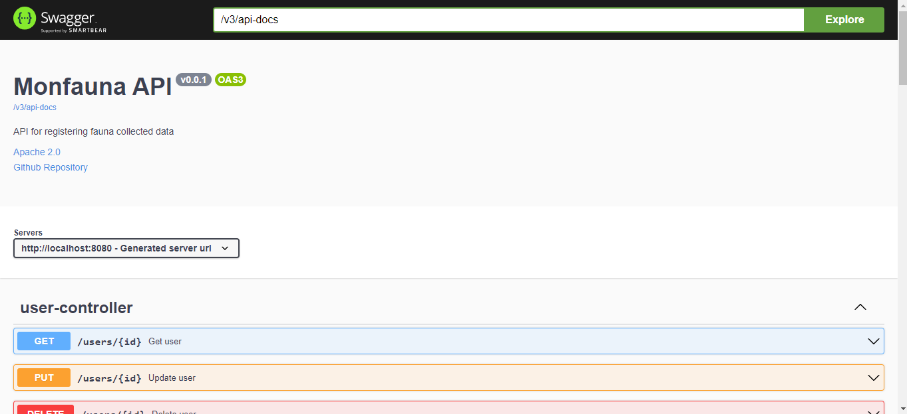
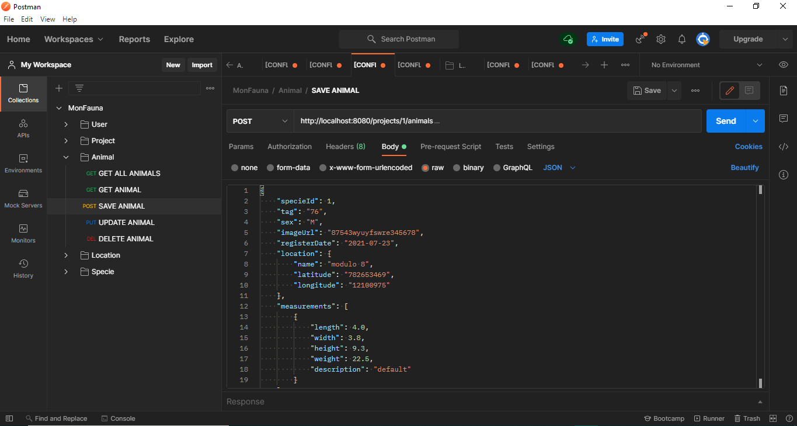
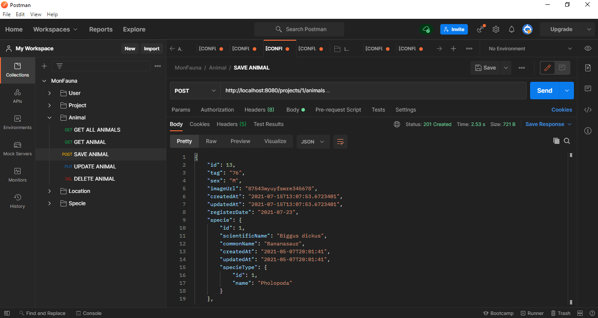
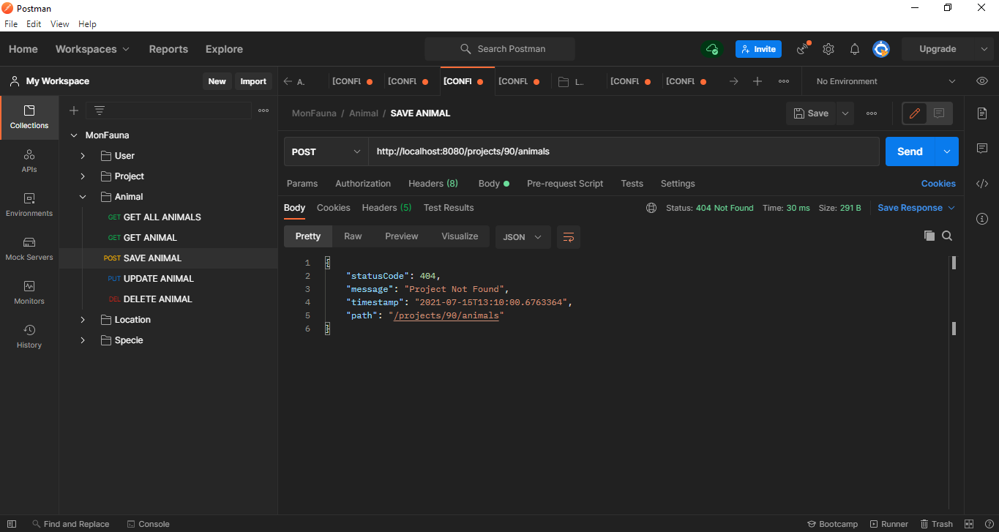

# Projeto Monfauna API

Link para o projeto sem Spring + informações de Arquitetura:

https://github.com/Shoku89/MonFaunaAPI

### Pre-requisitos

```
- JDK 11
- MySQL 5+
- IDE IntelliJ ou de sua preferência
- Postman
```

### Configuração do banco de dados

`/sql/criar_tabelasV2.sql`

### Documentação Swagger

`http://localhost:8080/swagger-ui.html`



### Post exemplo

Exemplo de requisição


Exemplo de resposta de sucesso


Exemplo de resposta de erro
